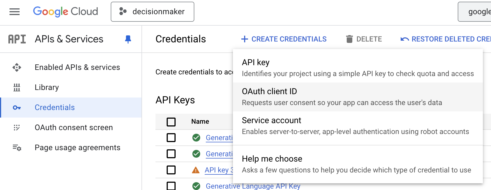
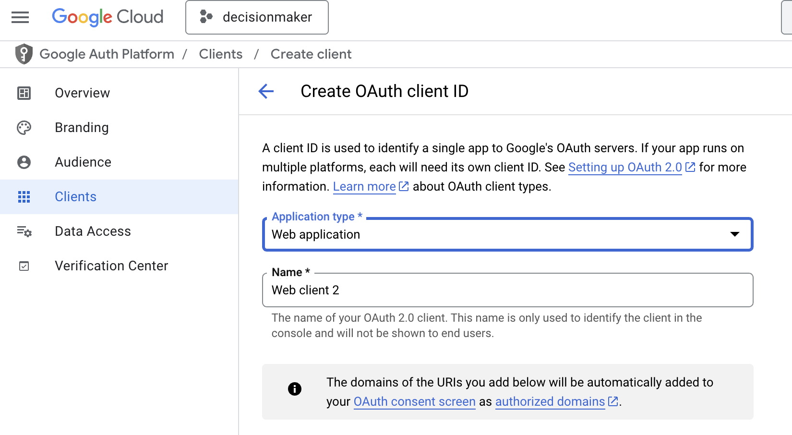
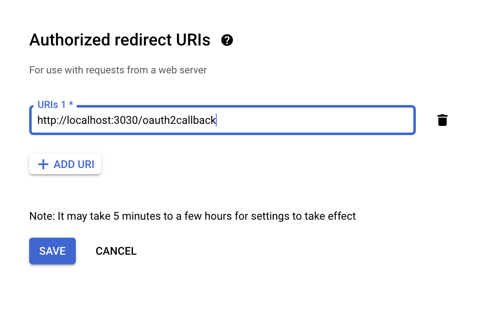
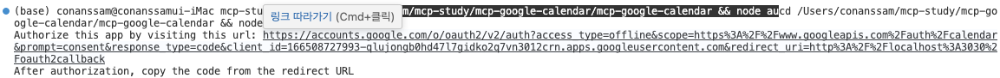
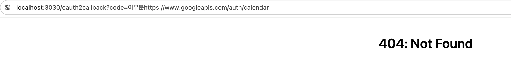

# Claude의 MCP Google Calendar 연결 가이드

이 문서는 Model Context Protocol(MCP)을 사용하여 Claude가 Google Calendar에 접근할 수 있도록 설정하는 방법을 자세히 설명합니다. 여러 시행착오와 해결책을 포함하고 있어 더 쉽게 설정할 수 있습니다.

## 목차

1. [사전 요구사항](#사전-요구사항)
2. [저장소 설정](#저장소-설정)
3. [Google OAuth 인증 설정](#google-oauth-인증-설정)
4. [리프레시 토큰 얻기](#리프레시-토큰-얻기)
5. [서버 설정 및 실행](#서버-설정-및-실행)
6. [Claude for Desktop 연결](#claude-for-desktop-연결)
   - macOS/Linux 환경
   - Windows 환경
7. [문제 해결](#문제-해결)

## 사전 요구사항

- Node.js v18 이상
- Google 계정
- Claude for Desktop
- 기본적인 터미널 사용법

## 저장소 설정

### 1. 저장소 클론

```bash
git clone https://github.com/markelaugust74/mcp-google-calendar.git
cd mcp-google-calendar
```

### 2. 디렉토리 구조 확인

저장소가 이중 구조로 되어 있을 수 있습니다. 다음 명령어로 확인하세요:

```bash
ls -la
```

`mcp-google-calendar` 폴더 내에 또 다른 `mcp-google-calendar` 폴더가 있는 경우, 내부 폴더로 이동합니다.

```bash
cd mcp-google-calendar
```

### 3. 종속성 설치

```bash
npm install
```

## Google OAuth 인증 설정

### 1. Google Cloud Console 준비

1. [Google Cloud Console](https://console.cloud.google.com/)에 로그인합니다.
2. 새 프로젝트를 생성합니다.
3. Google Calendar API를 활성화합니다:
   - 왼쪽 메뉴에서 "API 및 서비스" > "라이브러리" 선택
   - "Google Calendar API" 검색 후 활성화

### 2. OAuth 클라이언트 ID 생성

1. "API 및 서비스" > "사용자 인증 정보"로 이동합니다.
2. "사용자 인증 정보 만들기" > "OAuth 클라이언트 ID" 선택합니다.


3. 애플리케이션 유형은 "웹 애플리케이션"을 선택합니다.


4. 승인된 리디렉션 URI에 `http://localhost:3030/oauth2callback`을 추가합니다. (저는 3000이 이미 사용중이라 3030으로 했습니다)


5. "만들기"를 클릭하여 클라이언트 ID와 시크릿을 생성합니다.

### 3. 환경 변수 설정

프로젝트 폴더에 `.env` 파일을 생성하고 다음 내용을 추가합니다:

```
# Google OAuth2 credentials
CLIENT_ID=귀하의_클라이언트_ID
CLIENT_SECRET=귀하의_클라이언트_시크릿
REDIRECT_URI=http://localhost:3030/oauth2callback

# MCP Server settings
PORT=3030
MCP_SERVER_URL=http://localhost:3030

# Google Calendar API settings (optional)
# CALENDAR_ID=primary
```

## 리프레시 토큰 얻기

### 1. Auth.js 수정

auth.js 파일에서 반드시 `prompt: 'consent'` 옵션을 추가해야 리프레시 토큰을 얻을 수 있습니다:

```javascript
const authUrl = oauth2Client.generateAuthUrl({
  access_type: 'offline',
  scope: SCOPES,
  prompt: 'consent'  // 이 옵션이 중요합니다!
});
```

### 2. 인증 프로세스 실행

터미널에서 다음 명령어를 실행합니다:

```bash
node auth.js
```

### 3. 인증 코드 얻기

1. 표시된 URL을 브라우저에서 엽니다.


2. Google 계정으로 로그인하고 권한을 부여합니다.

3. 리디렉션된 URL에서 `code=` 다음에 오는 값을 복사합니다.


   ```
   http://localhost:3030/oauth2callback?code=4/0AQSTg...&scope=... <-- 여기서 'code=' 다음부터 '&scope=' 앞까지만 복사!!
   ```
   
   > **⚠️ 중요**: 인증 코드는 `code=` 다음부터 `&scope=` 앞까지의 부분만 복사해야 합니다! 전체 URL을 복사하지 마세요.
   
   404 오류가 발생해도 괜찮습니다.
   
4. 터미널에 복사한 코드를 붙여넣고 엔터를 누릅니다.

### 4. 리프레시 토큰 확인

성공하면 다음과 같은 메시지가 표시됩니다:

```
Your refresh token: 1//0eNafnMj...
```

> **⚠️ 매우 중요**: 위에 표시된 리프레시 토큰 값을 정확하게 복사하세요. 이 값은 인증 코드와 완전히 다르며, 반드시 이 리프레시 토큰을 index.js 파일에 추가해야 합니다.

## 서버 설정 및 실행

### 1. index.js 수정

index.js 파일에서 리프레시 토큰 부분을 찾아 업데이트합니다:

```javascript
oauth2Client.setCredentials({
  refresh_token: "여기에_리프레시_토큰_붙여넣기", // 반드시 "Your refresh token:" 다음에 표시된 값을 사용하세요!
  token_uri: "https://oauth2.googleapis.com/token"
});
```

> **🚨 가장 흔한 오류**: URL에서 추출한 인증 코드를 리프레시 토큰으로 착각하여 여기 입력하는 실수가 많습니다. 반드시 auth.js 실행 후 "Your refresh token:" 다음에 표시되는 값을 사용하세요.

### 2. 시간대 설정

한국 시간으로 제대로 일정이 표시되도록 시간대를 변경합니다:

```javascript
const event = {
  // ... 기존 코드 ...
  start: {
    dateTime: args.start_time,
    timeZone: 'Asia/Seoul',  // America/New_York에서 변경
  },
  end: {
    dateTime: args.end_time,
    timeZone: 'Asia/Seoul',  // America/New_York에서 변경
  }
};
```

## Claude for Desktop 연결

### macOS/Linux 환경

#### 1. Claude for Desktop 구성 파일 생성

다음 경로에 구성 파일을 생성합니다:
```
~/Library/Application Support/Claude/claude_desktop_config.json
```

#### 2. 구성 내용 추가

```json
{
  "mcpServers": {
    "google-calendar": {
      "command": "bash",
      "args": [
        "-c",
        "cd /절대/경로/mcp-google-calendar/mcp-google-calendar && node index.js"
      ]
    }
  }
}
```

### Windows 환경

#### 1. Claude for Desktop 구성 파일 생성

Windows에서는 다음 경로에 구성 파일을 생성합니다:

```
%APPDATA%\Claude\claude_desktop_config.json
```

이는 일반적으로 `C:\Users\사용자이름\AppData\Roaming\Claude\claude_desktop_config.json`과 같은 경로입니다.

#### 2. 배치 파일 생성

MCP 서버 실행을 위한 배치 파일을 생성하면 Windows에서 더 안정적으로 작동합니다. 프로젝트 폴더에 `run-calendar.bat` 파일을 생성하고 다음 내용을 추가합니다:

```batch
@echo off
cd /d D:\path\to\mcp-google-calendar
node index.js
```

`D:\path\to\mcp-google-calendar`를 실제 프로젝트 경로로 바꾸세요.

#### 3. 구성 내용 추가

```json
{
  "mcpServers": {
    "google-calendar": {
      "command": "D:\\path\\to\\mcp-google-calendar\\run-calendar.bat",
      "args": []
    }
  }
}
```

주의: Windows 경로에서는 백슬래시(`\`)를 두 개 사용해야 합니다.

#### 4. 주의사항: 올바른 리프레시 토큰 사용

Windows에서는 특히 주의해야 할 점으로, 인증 코드와 리프레시 토큰을 혼동하지 마세요:

- **인증 코드**: 브라우저에서 받은 URL의 `code=` 다음부터 `&scope=` 앞까지의 값
  - 예시: `4/0AQSTgQGxCBUNcl8eapA6jW4nRTQv1gM-Q_-N73iDcUGpQa3E087w0_-jdeacYzRNEFmbJQ`
  - ❌ 이 값을 index.js에 넣으면 `invalid_grant` 오류가 발생합니다!

- **리프레시 토큰**: `auth.js` 실행 후 "Your refresh token:" 다음에 표시되는 값
  - 예시: `1//0eNOnSp_LqfZ4CgYIARAAGA4SNwF-L9IrQSQKSZOtj-od75N5oCxiUb6yI_JtIawRfXApkIwz9OEVX7F_DBHc74XCeXH0j8ZvPKk`
  - ✅ 이 값을 index.js에 넣어야 합니다!

index.js 파일에 설정할 때 반드시 **리프레시 토큰**을 사용해야 합니다:

```javascript
oauth2Client.setCredentials({
  refresh_token: "1//0eNOnSp...(실제 리프레시 토큰)...", // 인증 코드가 아닌 리프레시 토큰이어야 합니다!
  token_uri: "https://oauth2.googleapis.com/token"
});
```

### 3. Claude for Desktop 재시작

Claude for Desktop을 완전히 종료하고 다시 시작합니다.

## 문제 해결

### 리프레시 토큰이 undefined로 표시되는 경우

1. auth.js에 `prompt: 'consent'` 옵션이 추가되어 있는지 확인합니다.
2. Google Cloud Console에서 리디렉션 URI가 .env 파일과 일치하는지 확인합니다.
3. 포트 번호가 일치하는지 확인합니다(3000에서 3030으로 변경한 경우).

### 시간대 문제

미국 동부 시간(America/New_York)과 한국 시간(Asia/Seoul) 사이에는 13~14시간 차이가 있습니다. 시간대를 'Asia/Seoul'로 변경하여 한국 시간에 맞게 일정을 추가할 수 있습니다.

### 서버 연결 문제

1. 실행 중인 서버 확인:  
ps aux | grep "node index.js" (Linux/macOS)  
tasklist | findstr "node.exe" (Windows)

2. 모든 서버 종료:  
pkill -f "node index.js" (Linux/macOS)  
taskkill /F /IM node.exe (Windows)

3. 로그 확인:  
tail -f ~/Library/Logs/Claude/mcp*.log (macOS)  
type %APPDATA%\Claude\logs\mcp*.log (Windows)

### Windows에서 "invalid_grant" 오류

Windows에서 "invalid_grant" 오류가 발생하면 **인증 코드와 리프레시 토큰을 혼동했을 가능성이 매우 높습니다**. 

**문제 상황**: 
- index.js 파일에 브라우저에서 받은 인증 코드를 붙여넣음 → 오류 발생
- 인증 코드는 짧은 수명을 가지며 일회성이므로 리프레시 토큰으로 사용할 수 없음

**해결 방법**:
1. auth.js를 다시 실행하세요: `node auth.js`
2. 브라우저에서 권한을 부여하고 인증 코드를 얻은 후 터미널에 입력하세요
3. 터미널에 표시되는 "Your refresh token:" 다음에 오는 값을 확인하세요
4. index.js 파일에서 리프레시 토큰을 이 값으로 업데이트하세요

인증 코드는 다음과 같은 형식입니다: `4/0AQSTgQGxCBUNcl8eapA6jW4nRTQv1gM-Q_-N73iDcUGpQa3E087w0_-jdeacYzRNEFmbJQ`

실제 리프레시 토큰은 다음과 같은 형식입니다: `1//0eNOnSp_LqfZ4CgYIARAAGA4SNwF-L9IrQSQKSZOtj-od75N5oCxiUb6yI_JtIawRfXApkIwz9OEVX7F_DBHc74XCeXH0j8ZvPKk`

### Windows에서 Claude가 MCP 서버를 찾지 못하는 문제

1. Claude Desktop이 index.js 파일을 찾지 못하면 배치 파일 방식으로 시도하세요.
2. 로그 파일을 확인하여 정확한 오류 메시지를 확인하세요: `%APPDATA%\Claude\logs\mcp-server-google-calendar.log`
3. claudeDesktop_config.json 파일이 올바른 위치에 있는지 확인하세요.
4. Claude Desktop을 관리자 권한으로 실행해 보세요.
5. 직접 서버를 실행한 후 Claude Desktop을 시작하는 방법도 시도해 볼 수 있습니다.

## 사용 방법

Claude for Desktop에서 다음과 같이 메시지를 입력하여 일정을 추가할 수 있습니다:

```
내일 오후 3시부터 4시까지 팀 미팅 일정을 추가해줘
```

Claude는 자동으로 MCP 서버를 통해 Google Calendar에 일정을 추가합니다.

---

이 가이드가 MCP를 통해 Claude를 Google Calendar와 연결하는 데 도움이 되기를 바랍니다. 문제가 발생하면 위의 문제 해결 섹션을 참조하세요. 
